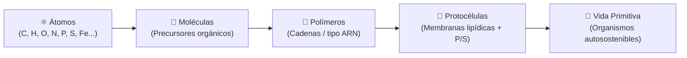

# 🪐 atmosfera 🥑

🌐 **[Read in English](README.md)**

**Simulación interactiva 3D low-poly de abiogénesis planetaria, química prebiótica y vida emergente.**

`atmosfera` es una simulación en tiempo real para el navegador creada por [aoxilus](https://github.com/aoxilus). Modela un planeta primordial donde elementos cósmicos caen desde el espacio, se desplazan por océanos y atmósferas volcánicas, se enlazan formando moléculas prebióticas, se ensamblan en cadenas de polímeros y sintetizan las primeras protocélulas con membrana y organismos primitivos.

Inspirada en las hipótesis de la sopa primordial y del mundo de hierro-azufre, la simulación combina un terreno planetario procedural 3D con una escalera de reglas emergentes ejecutada sobre un motor Three.js ligero y no bloqueante.

---

## ✨ Características

- 🪐 **Globo terráqueo procedural low-poly** — Esfera planetaria 3D completa con cordilleras montañosas, terreno suavizado, océanos con mareas dinámicas, resplandor atmosférico difuso y cuerpos celestes en órbita (Sol y Luna).
- 🧪 **Química prebiótica CHONPS** — 12 elementos primordiales inspirados en la Tierra (Oxígeno, Hidrógeno, Carbono, Nitrógeno, Silicio, Hierro, Azufre, Fósforo, Calcio, Sodio, Cloro y metales traza) con pesos orgánicos y afinidades de reacción balanceadas.
- 🌋 **Cráteres hidrotermales y chimeneas de magma** — 45 cráteres volcánicos activos que pulsan al ritmo de las mareas planetarias, arrojando elementos metálicos reactivos y complejos catalíticos de Hierro-Azufre (`Fe-S`) a zonas calientes de la superficie.
- ☄️ **Tormentas de meteoros y siembra cósmica** — Bombardeos dinámicos de asteroides que generan impactos a alta velocidad y dispersan bloques prebióticos frescos por toda la corteza.
- 🧬 **Escalera de abiogénesis por niveles** — Reglas de transición química deterministas: `Átomos` $\rightarrow$ `Moléculas` $\rightarrow$ `Polímeros` $\rightarrow$ `Protocélulas` $\rightarrow$ `Organismos primitivos`.
- 🎮 **Navegación híbrida orbital y rasante** — Controles fluidos de teclado (WASD, Q/E, R/F), órbita con arrastre del ratón, zoom con la rueda y límite automático de altura para evitar atravesar el terreno.
- 📊 **HUD en tiempo real y registro de eventos** — Panel interactivo de telemetría que muestra el recuento de partículas en vivo, la era evolutiva activa, la distribución elemental y un historial cronológico de reacciones químicas.
- ⚡ **Motor no bloqueante de alto rendimiento** — Desarrollado sobre Three.js y Vite con presupuestos de reacción por fotograma, cursores rotativos de partículas y radios de reacción localizados para mantener 60 FPS estables.

---

## 🎮 Controles y Navegación

| Entrada | Acción | Descripción |
| :--- | :--- | :--- |
| <kbd>W</kbd> / <kbd>↑</kbd> | Avanzar | Desplaza el foco de la cámara hacia adelante sobre la superficie |
| <kbd>S</kbd> / <kbd>↓</kbd> | Retroceder | Desplaza el foco de la cámara hacia atrás |
| <kbd>A</kbd> / <kbd>←</kbd> | Izquierda | Desplaza el foco de la cámara lateralmente a la izquierda |
| <kbd>D</kbd> / <kbd>→</kbd> | Derecha | Desplaza el foco de la cámara lateralmente a la derecha |
| <kbd>Q</kbd> / <kbd>E</kbd> | Rotación (Yaw) | Rota la cámara horizontalmente alrededor del punto de enfoque |
| <kbd>R</kbd> / <kbd>F</kbd> | Altitud / Zoom | Acerca / aleja la distancia de la cámara respecto a la superficie |
| <kbd>Shift</kbd> | Velocidad Turbo | Duplica la velocidad de desplazamiento |
| **Arrastre de Ratón** | Órbita Libre | Rota la vista y ajusta el ángulo de inclinación (pitch/yaw) |
| **Rueda de Ratón** | Zoom de Distancia | Zoom suave desde el espacio orbital hasta el nivel del suelo |

### Botones de Control de la Simulación

- **Pause / Resume (Pausa / Reanudar)**: Congela y reanuda la física de partículas, oscilaciones de mareas y bucles de enlaces químicos.
- **Seed Organics (Sembrar orgánicos)**: Inyecta un cúmulo rico en Carbono, Hidrógeno, Oxígeno, Nitrógeno, Fósforo y Azufre directamente en la capa oceánica visible.
- **Meteor Storm (Tormenta de meteoros)**: Desencadena una lluvia de asteroides desde el espacio profundo que impacta la superficie y dispersa elementos pesados reactivos.

---

## 🧪 La Escalera de Reglas de Abiogénesis

La simulación modela la transición espontánea de materia inerte a sistemas biológicos autorreplicantes a través de cinco fases clave:



1. **⚛️ Fase 1: Siembra Cósmica y Lluvia de Átomos**
   - Los átomos se generan en la alta atmósfera y caen bajo gravedad planetaria simulada hacia la superficie.
   - La distribución elemental se basa en las proporciones terrestres primordiales (O: 25%, H: 20%, C: 12%, N: 10%, Si: 8%, Fe: 6%, S: 4%, P: 3%, etc.).

2. **🧪 Fase 2: Síntesis Molecular**
   - Cuando dos átomos colisionan a corta distancia ($<22$ unidades), se enlazan para formar moléculas tempranas.
   - Los elementos biógenos aportan puntuación orgánica positiva ($C=+3, N=+2, P=+2, O=+1, H=+1, S=+1$).

3. **🧬 Fase 3: Formación de Cadenas de Polímeros**
   - Cuando los cúmulos orgánicos alcanzan suficiente complejidad química ($\ge 13$ de puntuación orgánica y $\ge 5$ átomos enlazados), las moléculas se estructuran en cadenas de polímeros estables.

4. **🫧 Fase 4: Vesículas y Protocélulas**
   - Cuando las cadenas de polímeros incorporan elementos estructurales de membrana (**Fósforo** para fosfatos y **Azufre** para puentes catalíticos) bajo suficiente energía térmica ambiental ($> 0.62$), se forma una **protocélula** con membrana.

5. **🌱 Fase 5: Vida Primitiva Emergente**
   - Cuando una protocélula absorbe moléculas orgánicas adicionales en zonas de marea templada o cráteres volcánicos ($\ge 18$ de puntuación orgánica y $> 0.54$ de energía), evoluciona a **vida primitiva**, avanzando la era planetaria en el HUD.

---

## 🌋 Chimeneas Volcánicas y Catálisis Mineral

La química superficial no es uniforme. Los cráteres volcánicos y chimeneas hidrotermales actúan como motores químicos:

- **Pulsos Térmicos de Magma**: 45 lagos de lava en cráteres pulsan con tonalidades rojas/naranjas en fase con el ciclo de marea global.
- **Erupciones Catalíticas**: Las chimeneas emiten periódicamente ráfagas de hierro, azufre, silicio, fósforo y complejos catalíticos preformados de **Hierro-Azufre (`Fe-S`)**.
- **Mezcla por Mareas**: El nivel del océano oscila suavemente, bañando y mezclando los elementos en contacto con las superficies minerales cálidas.

---

## 🚀 Inicio rápido

### Prerrequisitos

- [Node.js](https://nodejs.org/) (versión 18.0.0 o superior recomendada)
- [npm](https://www.npmjs.com/) (incluido con Node.js)

### Instalación

```bash
# 1. Clonar el repositorio
git clone https://github.com/aoxilus/atmosfera.git

# 2. Entrar en la carpeta del proyecto
cd atmosfera

# 3. Instalar dependencias
npm install
```

### Servidor de Desarrollo

Inicia el servidor local de desarrollo Vite con recarga en caliente:

```bash
npm run dev
```

Abre tu navegador en `http://localhost:5173` para explorar el planeta primordial.

### Ejecución de Pruebas

Ejecuta el conjunto de pruebas unitarias con Vitest para validar las mecánicas de simulación, constantes de escala y reglas de reacción:

```bash
npm test
```

### Compilación para Producción

Compila y empaqueta la aplicación optimizada para producción:

```bash
npm run build
```

Los archivos estáticos optimizados se generarán en el directorio `dist/`.

---

## 🧠 Arquitectura y Sistemas del Motor

El proyecto está diseñado con una separación clara entre la lógica matemática pura de la simulación y la representación visual en Three.js:

```
abiogenesis-sandbox/
├── index.html               # Estructura semántica HTML5, contenedores del HUD y controles
├── style.css                # Estilos visuales dark, glassmorphism e interfaz responsiva
├── main.js                  # Escena Three.js, iluminación, cámara y bucles de partículas
├── simulation-core.js       # Reglas matemáticas puras, constantes y lógica de reacción
├── simulation-core.test.js  # Suite de pruebas unitarias con Vitest
├── package.json             # Metadatos del proyecto y scripts de Vite/Vitest
└── LICENSE                  # Licencia Creative Commons CC BY-NC-SA 4.0
```

### Subsistemas Clave

- **Simulación con Presupuesto por Fotograma (Budgeting)**: Para garantizar 60 FPS estables independientemente del número de partículas:
  - Las actualizaciones de partículas se procesan mediante un cursor rotativo (`180` partículas por fotograma).
  - Las comprobaciones de proximidad química están limitadas a un máximo de `120` por fotograma.
  - Las emisiones volcánicas y tormentas de meteoros se disparan en intervalos de ticks diferenciados.
- **Funciones Puras Deterministas**: Todas las fórmulas de relieve montañoso, oscilación de mareas, pulsos de lava y clasificación de reacciones residen en `simulation-core.js` y son testeadas de forma unitaria independientemente de WebGL.
- **Sombreado Low-Poly Procedural**: Geometrías `IcosahedronGeometry` con sombreado plano (`flatShading`) y coloreado por vértices para lograr una estética nítida y retro-moderna.

---

## ❓ Preguntas frecuentes (FAQ)

**P: ¿Puede surgir vida de forma completamente automática sin pulsar botones?**  
R: Sí. La lluvia continua de átomos, la gravedad y las erupciones volcánicas concentran los elementos de manera natural. No obstante, pulsar **«Seed organics»** o **«Meteor storm»** acelera el proceso al introducir cúmulos de alta energía.

**P: ¿La simulación utiliza física atómica real?**  
R: Es un modelo fenomenológico emergente inspirado en la química prebiótica real (experimento de Miller-Urey, hipótesis del mundo de hierro-azufre de Wächtershäuser y teorías del mundo de ARN), calibrado para que las transiciones de vida ocurran en minutos en lugar de millones de años.

**P: ¿Por qué no se ven todas las partículas desde la vista lejana?**  
R: Por claridad visual y optimización de rendimiento, únicamente las partículas dentro del radio de observación activo (`1600` unidades) se renderizan y participan en comprobaciones de enlaces químicos.

**P: ¿Puedo añadir nuevos elementos químicos o etapas de reacción?**  
R: Sí. Puedes modificar la tabla `atoms` en `main.js` o añadir nuevas reglas de transición dentro de `classifyReaction()` en `simulation-core.js`.

---

## 📋 Requisitos

- **Navegador**: Cualquier navegador moderno con soporte para WebGL2 (Chrome, Edge, Firefox, Safari, Brave).
- **Entorno**: Node.js 18+ (para desarrollo local y compilación).

---

## 📄 Licencia

Este proyecto está bajo la licencia **Creative Commons Atribución-NoComercial-CompartirIgual 4.0 Internacional (CC BY-NC-SA 4.0)**. Consulta el archivo [LICENSE](LICENSE) para más detalles.

---

## 🤝 Contribuciones

¡Las sugerencias, reportes de errores e ideas son bienvenidos! Puedes abrir un issue o enviar un pull request.

---

*Hecho con 🥑 por [aoxilus](https://github.com/aoxilus)*
