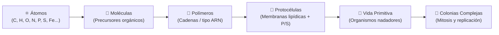

# 🪐 atmosfera 🥑

🌐 **[Read in English](README.md)**

**Simulación interactiva 3D low-poly de abiogénesis planetaria, química prebiótica y vida motil emergente.**

`atmosfera` es una simulación en tiempo real para el navegador creada por [aoxilus](https://github.com/aoxilus). Modela un planeta primordial donde elementos cósmicos caen desde el espacio, se desplazan por océanos y atmósferas volcánicas, se enlazan formando moléculas prebióticas, se ensamblan en cadenas de polímeros, sintetizan protocélulas con membrana y evolucionan en organismos nadadores autónomos que se alimentan, crecen y se replican por mitosis.

Inspirada en las hipótesis de la sopa primordial y del mundo de hierro-azufre, la simulación combina un terreno planetario procedural 3D con una escalera de reglas emergentes ejecutada sobre un motor Three.js ligero y no bloqueante.

---

## ✨ Características

- 🪐 **Globo terráqueo procedural low-poly** — Esfera planetaria 3D completa con relieve multi-octava (cuencas abisales, plataformas litorales, tierras bajas fértiles, cumbres rocosas), océanos con mareas dinámicas, resplandor atmosférico difuso y cuerpos celestes en órbita (Sol y Luna).
- 🧪 **Química prebiótica CHONPS** — 12 elementos primordiales inspirados en la Tierra (Oxígeno, Hidrógeno, Carbono, Nitrógeno, Silicio, Hierro, Azufre, Fósforo, Calcio, Sodio, Cloro y metales traza) con pesos orgánicos y afinidades de reacción calibradas.
- 🌋 **Cráteres hidrotermales y chimeneas de magma** — 45 cráteres volcánicos activos anclados profundamente en el lecho rocoso, expulsando minerales reactivos y moléculas prebióticas diversas (`Fe-S`, `H2S`, `SO2`, `HCN`, `CO2`, `NH3`, `PolyP`).
- ☄️ **Tormentas de meteoros y siembra cósmica** — Bombardeos dinámicos de asteroides que generan impactos a alta velocidad y dispersan bloques prebióticos frescos por toda la corteza.
- 🧬 **Escalera de abiogénesis por niveles** — Reglas de transición química deterministas: `Átomos` $\rightarrow$ `Moléculas` $\rightarrow$ `Polímeros` $\rightarrow$ `Protocélulas` $\rightarrow$ `Organismos Primitivos` $\rightarrow$ `Colonias Complejas`.
- 🏊‍♂️ **Motilidad autónoma y mitosis** — Los organismos vivos nadan activamente por los océanos, reptan por aguas someras, absorben nutrientes de átomos cercanos y experimentan **división celular (mitosis)** al saturarse de energía.
- ☁️ **Nubes translúcidas y vientos atmosféricos** — Nubes low-poly en racimos con suave transparencia atmosférica que derivan en corrientes en chorro y bandas de vientos alisios.
- 🌊 **Respiración suave de mareas** — Oscilación continua del nivel del mar sin vibración ni Z-fighting, dejando al descubierto planicies en bajamar e inundando lagunas en pleamar.
- 🎮 **Navegación híbrida orbital y rasante** — Controles fluidos de teclado (WASD, Q/E, R/F, Shift), órbita con arrastre del ratón, zoom con la rueda y límite automático de altura.
- 📊 **HUD en tiempo real y motor de probabilidades** — Panel de telemetría con recuento de partículas en vivo, era evolutiva activa, distribución elemental y matriz matemática de probabilidades de abiogénesis.
- ⚡ **Motor no bloqueante de alto rendimiento** — Desarrollado sobre Three.js y Vite con presupuestos de reacción por fotograma, cursores rotativos de partículas y radios de reacción localizados para mantener 60 FPS estables.

---

## 🎮 Controles y Navegación

| Entrada | Acción | Descripción |
| :--- | :--- | :--- |
| <kbd>W</kbd> / <kbd>↑</kbd> | Avanzar | Desplaza el foco de la cámara hacia adelante sobre la superficie |
| <kbd>S</kbd> / <kbd>↓</kbd> | Retroceder | Desplaza el foco de la cámara hacia atrás |
| <kbd>A</kbd> / <kbd>←</kbd> | Izquierda | Desplaza el foco de la cámara lateralmente a la izquierda |
| <kbd>D</kbd> / <kbd>→</kbd> | Derecha | Desplaza el foco de la cámara lateralmente a la derecha |
| <kbd>Q</kbd> / <kbd>E</kbd> | Rotación (Yaw) | Rota la cámara horizontalmente alrededor del punto de enfoque |
| <kbd>R</kbd> / <kbd>F</kbd> | Altitud / Zoom | Acerca / aleja la distancia de la cámara respecto a la superficie |
| <kbd>Shift</kbd> | Velocidad Turbo | Duplica la velocidad de desplazamiento |
| **Arrastre de Ratón** | Órbita Libre | Rota la vista y ajusta el ángulo de inclinación (pitch/yaw) |
| **Rueda de Ratón** | Zoom de Distancia | Zoom suave desde el espacio orbital hasta el nivel del suelo |

### Botones de Control de la Simulación

- **Pause / Resume**: Congela y reanuda la física de partículas, oscilaciones de mareas y bucles de enlaces químicos.
- **Seed Organics**: Inyecta un cúmulo rico en Carbono, Hidrógeno, Oxígeno, Nitrógeno, Fósforo y Azufre directamente en la capa oceánica visible.
- **Catalyze Life**: Inyecta compuestos catalíticos de alta energía (`Fe-S`, `PolyP`, `P`, `S`, `C`) en respiraderos hidrotermales para detonar la aparición de vida nadadora.
- **Meteor Storm**: Desencadena una lluvia de asteroides desde el espacio profundo que impacta la superficie y dispersa elementos pesados reactivos.

---

## 🧪 La Escalera de Reglas de Abiogénesis

La simulación modela la transición espontánea de materia inerte a sistemas biológicos autorreplicantes a través de cinco fases clave:



1. **⚛️ Fase 1: Siembra Cósmica y Lluvia de Átomos**
   - Los átomos se generan en la alta atmósfera y caen bajo gravedad planetaria simulada hacia la superficie (74% elementos CHONPS prebióticos).

2. **🧪 Fase 2: Síntesis Molecular**
   - Cuando dos átomos colisionan a corta distancia ($<26$ unidades), se enlazan para formar moléculas tempranas.

3. **🧬 Fase 3: Formación de Cadenas de Polímeros**
   - Cuando los cúmulos orgánicos alcanzan suficiente complejidad ($\ge 10$ de puntuación y $\ge 3$ átomos), se estructuran en cadenas de polímeros estables.
   - Complejos de Hierro-Azufre (`Fe-S`) y polifosfatos actúan como catalizadores, elevando las probabilidades de polimerización del 12% al 42%.

4. **🫧 Fase 4: Vesículas y Protocélulas**
   - Cuando las cadenas incorporan **Fósforo** y **Azufre** bajo suficiente calor ambiental ($> 0.48$), se forma una **protocélula** con membrana lipídica y respiración pulsante.

5. **🌱 Fase 5: Organismos Nadadores Autónomos**
   - Al absorber nutrientes adicionales en zonas templadas ($\ge 15$ de puntuación y $> 0.45$ de energía), la protocélula evoluciona a un **organismo nadador autónomo** que se propulsa por los mares, rota cilios y absorbe átomos crudos como alimento.

6. **🦠 Fase 6: Colonias Complejas y Mitosis**
   - Al acumular energía ($> 0.88$) y alimento suficiente, el organismo experimenta **división celular (mitosis)**, dividiéndose en dos y liberando organismos hijos.

---

## 🧮 Probabilidades Calculadas de Abiogénesis

| Nivel de Transición | Condiciones de Mar Abierto | Respiraderos Hidrotermales y Mareas |
| :--- | :---: | :---: |
| **Enlace Molecular por Colisión** | 38% | 84% *(catalizado)* |
| **Formación de Polímeros** | 12% | 42% *(acelerado por Fe-S y PolyP)* |
| **Encapsulamiento de Protocélulas** | 6% | 38% *(con P + S + energía térmica)* |
| **Aparición de Organismos Vivos** | 8% | 48% *(en charcas litorales cálidas)* |
| **Tasa de División por Mitosis** | 4% | 22% *(en estado de alimentación activa)* |

---

## 🚀 Inicio rápido

### Prerrequisitos

- [Node.js](https://nodejs.org/) (versión 18.0.0 o superior recomendada)
- [npm](https://www.npmjs.com/) (incluido con Node.js)

### Instalación

```bash
# 1. Clonar el repositorio
git clone https://github.com/aoxilus/atmosfera.git

# 2. Entrar en la carpeta del proyecto
cd atmosfera

# 3. Instalar dependencias
npm install
```

### Servidor de Desarrollo

Inicia el servidor local de desarrollo Vite con recarga en caliente:

```bash
npm run dev
```

Abre tu navegador en `http://localhost:5173` para explorar el planeta primordial.

### Ejecución de Pruebas

Ejecuta el conjunto de pruebas unitarias con Vitest:

```bash
npm test
```

### Compilación para Producción

Compila y empaqueta la aplicación optimizada para producción:

```bash
npm run build
```

### Sincronización y Respaldo a GitHub

Para commitear, respaldar y subir todo a GitHub en un solo paso:

```powershell
# Script de PowerShell
.\push-github.ps1

# O haz doble clic sobre push-github.bat en el Explorador de Windows
```

---

## 🧠 Arquitectura y Sistemas del Motor

```
abiogenesis-sandbox/
├── index.html               # Estructura semántica HTML5, HUD y controles
├── style.css                # Estilos visuales dark, glassmorphism e interfaz responsiva
├── main.js                  # Escena Three.js, iluminación, cámara y bucles de partículas
├── simulation-core.js       # Reglas matemáticas puras, constantes y lógica de reacción
├── simulation-core.test.js  # Suite de pruebas unitarias con Vitest (14/14 tests)
├── push-github.ps1          # Script de automatización para commit y push a GitHub
├── push-github.bat          # Lanzador por doble clic para Windows
├── package.json             # Metadatos del proyecto y scripts de Vite/Vitest
└── LICENSE                  # Licencia Creative Commons CC BY-NC-SA 4.0
```

---

## ❓ Preguntas frecuentes (FAQ)

**P: ¿Puede surgir vida de forma completamente automática sin pulsar botones?**  
R: Sí. La lluvia continua de átomos, la gravedad y las erupciones volcánicas concentran los elementos de manera natural. Pulsar **«Catalyze life»** o **«Seed organics»** acelera el proceso al introducir cúmulos prebióticos concentrados.

**P: ¿Los organismos realmente nadan y se reproducen?**  
R: ¡Sí! A diferencia de los átomos inertes que flotan por gravedad y viento, los organismos poseen vectores de motilidad autónomos, trayectorias sinusoidales de nado, absorción de nutrientes y división celular mitótica al alcanzar umbrales de energía.

**P: ¿Cómo se eliminó la vibración del océano?**  
R: El material del océano utiliza bias de polígonos de WebGL (`polygonOffset: true`) y una resolución geométrica desfasada respecto a la tierra, eliminando por completo el Z-fighting coplanar.

---

## 📋 Requisitos

- **Navegador**: Cualquier navegador moderno con soporte para WebGL2 (Chrome, Edge, Firefox, Safari, Brave).
- **Entorno**: Node.js 18+ (para desarrollo local y compilación).

---

## 📄 Licencia

Este proyecto está bajo la licencia **Creative Commons Atribución-NoComercial-CompartirIgual 4.0 Internacional (CC BY-NC-SA 4.0)**. Consulta el archivo [LICENSE](LICENSE) para más detalles.

---

## 🤝 Contribuciones

¡Las sugerencias, reportes de errores e ideas son bienvenidos! Puedes abrir un issue o enviar un pull request.

---

*Hecho con 🥑 por [aoxilus](https://github.com/aoxilus)*
