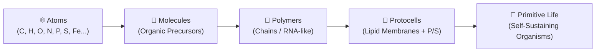

# 🪐 atmosfera 🥑

🌐 **[Leer en Español](README.es.md)**

**Interactive 3D low-poly simulation of planetary abiogenesis, prebiotic chemistry, and emergent life.**

`atmosfera` is a real-time browser simulation created by [aoxilus](https://github.com/aoxilus). It models a primordial planet where raw cosmic elements rain from space, drift through oceans and volcanic atmosphere, bond into prebiotic molecules, assemble into polymer chains, and synthesize the first membrane-bound protocells and primitive organisms.

Inspired by the primordial soup and iron-sulfur world hypotheses, the simulation couples procedural 3D planetary terrain with an emergent rule ladder running on a lightweight, non-blocking Three.js engine.

---

## ✨ Features

- 🪐 **Procedural Low-Poly Globe** — Full 3D planetary sphere with mountain ranges, smoothed terrain, dynamic tidal oceans, atmospheric scattering glow, and orbiting celestial light sources (Sun & Moon).
- 🧪 **Prebiotic CHONPS Chemistry** — 12 Earth-inspired primordial elements (Oxygen, Hydrogen, Carbon, Nitrogen, Silicon, Iron, Sulfur, Phosphorus, Calcium, Sodium, Chlorine, and trace metals) with tuned organic scores and reaction affinities.
- 🌋 **Hydrothermal Craters & Magma Vents** — 45 active volcanic craters that pulse in rhythm with planetary tides, spewing reactive metallic elements and catalytic Iron-Sulfur (`Fe-S`) clusters into surface hotspots.
- ☄️ **Meteor Storms & Cosmic Seeding** — Dynamic asteroid bombardments that deliver high-velocity cosmic impacts and scatter fresh prebiotic building blocks across the crust.
- 🧬 **Multi-Tier Abiogenesis Ladder** — Deterministic chemical transition rules: `Atoms` $\rightarrow$ `Molecules` $\rightarrow$ `Polymers` $\rightarrow$ `Protocells` $\rightarrow$ `Primitive Organisms`.
- 🎮 **Hybrid Orbital & Surface Navigation** — Fluid keyboard controls (WASD, Q/E, R/F), mouse drag orbit, mouse wheel zoom, and automatic terrain-height clamping preventing underground clipping.
- 📊 **Real-time HUD & Live Event Feed** — Interactive telemetry dashboard showing live particle counts, active evolutionary era, elemental distribution, and a chronological log of chemical discoveries.
- ⚡ **High-Performance Non-Blocking Engine** — Built on Three.js and Vite with per-frame reaction budgets, rolling particle cursor updates, and localized reaction radii maintaining 60 FPS.

---

## 🎮 Controls & Navigation

| Input | Action | Description |
| :--- | :--- | :--- |
| <kbd>W</kbd> / <kbd>↑</kbd> | Move Forward | Moves the camera target across the planetary surface |
| <kbd>S</kbd> / <kbd>↓</kbd> | Move Backward | Moves the camera target backward |
| <kbd>A</kbd> / <kbd>←</kbd> | Move Left | Strafe camera target left |
| <kbd>D</kbd> / <kbd>→</kbd> | Move Right | Strafe camera target right |
| <kbd>Q</kbd> / <kbd>E</kbd> | Yaw / Rotate | Pan camera horizontally around the focus point |
| <kbd>R</kbd> / <kbd>F</kbd> | Zoom Altitude | Zoom camera distance in / out relative to surface |
| <kbd>Shift</kbd> | Turbo Speed | Doubles navigation traversal speed |
| **Mouse Drag** | Free Orbit | Rotate view and adjust pitch/yaw angle |
| **Mouse Wheel** | Zoom Distance | Smooth zoom from deep orbital space to surface level |

### Simulation Control Buttons

- **Pause / Resume**: Freezes and unfreezes particle physics, tidal oscillations, and chemical bonding loops.
- **Seed Organics**: Injects an organic-rich cluster of Carbon, Hydrogen, Oxygen, Nitrogen, Phosphorus, and Sulfur directly into the visible ocean layer.
- **Meteor Storm**: Triggers an asteroid barrage from deep space that impacts the surface and scatters heavy reactive elements.

---

## 🧪 The Abiogenesis Rule Ladder

The simulation models the spontaneous transition from non-living matter to self-replicating biological systems through five distinct phases:



1. **⚛️ Phase 1: Cosmic Seeding & Atom Rain**
   - Atoms spawn in the upper atmosphere and fall under simulated planetary gravity toward the surface.
   - Elements are weighted based on primordial terrestrial abundances (O: 25%, H: 20%, C: 12%, N: 10%, Si: 8%, Fe: 6%, S: 4%, P: 3%, etc.).

2. **🧪 Phase 2: Molecular Synthesis**
   - When atoms collide within close proximity ($<22$ units), they bond to form early molecules.
   - Organic elements contribute positive organic scores ($C=+3, N=+2, P=+2, O=+1, H=+1, S=+1$).

3. **🧬 Phase 3: Polymer Chain Formation**
   - When organic clusters achieve sufficient chemical complexity ($\ge 13$ organic score and $\ge 5$ bonded atoms), molecules link into stable polymer chains.

4. **🫧 Phase 4: Protocell Vesicles**
   - When polymer chains combine with critical membrane elements (**Phosphorus** for phosphates and **Sulfur** for catalytic bonds) under sufficient environmental thermal energy ($> 0.62$), a membrane-bound **protocell** forms.

5. **🌱 Phase 5: Emergent Primitive Life**
   - When a protocell absorbs additional organic molecules in warm tidal or volcanic zones ($\ge 18$ organic score and $> 0.54$ energy), it transitions into **primitive life**, advancing the planetary era.

---

## 🌋 Volcanic Hotspots & Catalysis

Surface chemistry is non-uniform. Volcanic craters and hydrothermal vents act as chemical engines:

- **Thermal Magma Pulses**: 45 crater pools pulse with red/orange emissions in phase with the global tidal cycle.
- **Catalytic Eruptions**: Vents intermittently launch bursts of iron, sulfur, silicon, phosphorus, and pre-formed **Iron-Sulfur (`Fe-S`)** catalytic complexes.
- **Tidal Mixing**: Ocean water levels gently oscillate, washing elements into contact with warm mineral surfaces.

---

## 🚀 Quick Start

### Prerequisites

- [Node.js](https://nodejs.org/) (v18.0.0 or higher recommended)
- [npm](https://www.npmjs.com/) (included with Node.js)

### Installation

```bash
# 1. Clone the repository
git clone https://github.com/aoxilus/atmosfera.git

# 2. Enter the project directory
cd atmosfera

# 3. Install dependencies
npm install
```

### Development Server

Start the local Vite dev server with hot module reloading:

```bash
npm run dev
```

Open your browser at `http://localhost:5173` to explore the primordial world.

### Running Tests

Execute the Vitest test suite for core simulation mechanics, scale constants, and reaction rules:

```bash
npm test
```

### Production Build

Compile and bundle the production-ready application:

```bash
npm run build
```

The optimized static assets will be generated in the `dist/` directory.

---

## 🧠 Architecture & Systems

The project is structured with a clean separation between pure simulation logic and Three.js visual rendering:

```
abiogenesis-sandbox/
├── index.html               # Semantic HTML5 layout, HUD containers, and controls
├── style.css                # Dark modern glassmorphic UI and responsive styles
├── main.js                  # Three.js scene, lighting, camera controls, particle loops
├── simulation-core.js       # Pure mathematical rules, constants, and reaction logic
├── simulation-core.test.js  # Vitest unit test suite
├── package.json             # Project metadata, Vite & Vitest scripts
└── LICENSE                  # Creative Commons CC BY-NC-SA 4.0
```

### Key Subsystems

- **Frame-Budgeted Simulation**: To guarantee smooth 60 FPS performance regardless of particle count, expensive tasks are capped per frame:
  - Particle updates are processed through a rolling cursor (`180` updates/frame).
  - Chemical proximity checks are capped at `120` checks/frame.
  - Volcanic emissions and meteor checks trigger on distinct tick intervals.
- **Deterministic Pure Functions**: All terrain displacement formulas, tidal scales, lava pulse math, and reaction classifications live in `simulation-core.js` and are unit-tested independently of WebGL.
- **Procedural Low-Poly Shading**: Flat-shaded `IcosahedronGeometry` with custom vertex coloring creates a crisp, readable retro-modern aesthetic.

---

## ❓ FAQ

**Q: Can life emerge completely automatically without clicking any buttons?**  
A: Yes. Continuous atom rain, gravity, and volcanic eruptions naturally drive atoms together. However, clicking **"Seed organics"** or **"Meteor storm"** accelerates the process by introducing high-energy clusters.

**Q: Does the simulation use real atomic physics?**  
A: It is an emergent phenomenological model inspired by real prebiotic chemistry (the Miller-Urey experiment, Wächtershäuser's Iron-Sulfur world, and RNA-world theories), balanced so life synthesis occurs within minutes instead of millions of years.

**Q: Why are distant particles hidden?**  
A: For visual clarity and computational performance, only particles within the active observer radius (`1600` units) are fully rendered and checked for chemical bonding.

**Q: Can I add new chemical elements or custom reaction stages?**  
A: Absolutely. You can modify the `atoms` table in `main.js` or add new transition rules inside `classifyReaction()` in `simulation-core.js`.

---

## 📋 Requirements

- **Browser**: Any modern browser supporting WebGL2 (Chrome, Edge, Firefox, Safari, Brave).
- **Environment**: Node.js 18+ (for local development and bundling).

---

## 📄 License

This project is licensed under the **Creative Commons Attribution-NonCommercial-ShareAlike 4.0 International (CC BY-NC-SA 4.0)** license. See the [LICENSE](LICENSE) file for complete details.

---

## 🤝 Contributing

Contributions, bug reports, and ideas are welcome! Feel free to open an issue or submit a pull request.

---

*Made with 🥑 by [aoxilus](https://github.com/aoxilus)*
