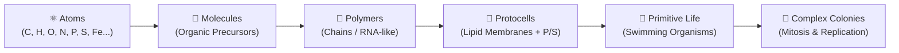

# 🪐 atmosfera 🥑

🌐 **[Leer en Español](README.es.md)**

**Interactive 3D low-poly simulation of planetary abiogenesis, prebiotic chemistry, and emergent motile life.**

`atmosfera` is a real-time browser simulation created by [aoxilus](https://github.com/aoxilus). It models a primordial planet where raw cosmic elements rain from space, drift through oceans and volcanic atmospheres, bond into prebiotic molecules, assemble into polymer chains, synthesize membrane-bound protocells, and evolve into autonomous swimming organisms that feed, grow, and replicate by mitosis.

Inspired by the primordial soup and iron-sulfur world hypotheses, the simulation couples procedural 3D planetary terrain with an emergent rule ladder running on a lightweight, non-blocking Three.js engine.

---

## ✨ Features

- 🪐 **Procedural Low-Poly Globe** — Full 3D planetary sphere with multi-octave relief (abyssal basins, coastal shelves, fertile lowlands, rocky mountain peaks), dynamic tidal oceans, atmospheric scattering glow, and orbiting celestial light sources (Sun & Moon).
- 🧪 **Prebiotic CHONPS Chemistry** — 12 Earth-inspired primordial elements (Oxygen, Hydrogen, Carbon, Nitrogen, Silicon, Iron, Sulfur, Phosphorus, Calcium, Sodium, Chlorine, and trace metals) with calibrated organic weights and reaction affinities.
- 🌋 **Hydrothermal Craters & Magma Vents** — 45 active volcanic craters deeply anchored into the planetary bedrock, spewing reactive minerals and diverse prebiotic molecules (`Fe-S`, `H2S`, `SO2`, `HCN`, `CO2`, `NH3`, `PolyP`).
- ☄️ **Meteor Storms & Cosmic Seeding** — Dynamic asteroid bombardments that deliver high-velocity cosmic impacts and scatter fresh prebiotic building blocks across the crust.
- 🧬 **Multi-Tier Abiogenesis Ladder** — Deterministic chemical transition rules: `Atoms` $\rightarrow$ `Molecules` $\rightarrow$ `Polymers` $\rightarrow$ `Protocells` $\rightarrow$ `Primitive Organisms` $\rightarrow$ `Complex Colonial Life`.
- 🏊‍♂️ **Autonomous Motility & Mitosis** — Living organisms actively swim through oceans, crawl along tidal shallows, hunt nearby atoms for food, and undergo **cellular division (mitosis)** when saturated with energy.
- ☁️ **Translucent Clouds & Atmospheric Winds** — Clustered low-poly clouds with soft atmospheric transparency drifting along latitudinal jet streams and trade wind ribbons.
- 🌊 **Smooth Tidal Respiration** — Seamless ocean level oscillation without Z-fighting or vibration, revealing coastal flats at low tide and submerging lagoons at high tide.
- 🎮 **Hybrid Orbital & Surface Navigation** — Fluid keyboard controls (WASD, Q/E, R/F, Shift), mouse drag orbit, mouse wheel zoom, and automatic terrain-height clamping.
- 📊 **Real-time HUD & Probability Engine** — Interactive telemetry dashboard showing live particle counts, active evolutionary era, elemental distribution, and a real-time mathematical abiogenesis odds matrix.
- ⚡ **High-Performance Non-Blocking Engine** — Built on Three.js and Vite with per-frame reaction budgets, rolling particle cursor updates, and localized reaction radii maintaining a locked 60 FPS.

---

## 🎮 Controls & Navigation

| Input | Action | Description |
| :--- | :--- | :--- |
| <kbd>W</kbd> / <kbd>↑</kbd> | Move Forward | Moves the camera target across the planetary surface |
| <kbd>S</kbd> / <kbd>↓</kbd> | Move Backward | Moves the camera target backward |
| <kbd>A</kbd> / <kbd>←</kbd> | Move Left | Strafe camera target left |
| <kbd>D</kbd> / <kbd>→</kbd> | Move Right | Strafe camera target right |
| <kbd>Q</kbd> / <kbd>E</kbd> | Yaw / Rotate | Pan camera horizontally around the focus point |
| <kbd>R</kbd> / <kbd>F</kbd> | Zoom Altitude | Zoom camera distance in / out relative to surface |
| <kbd>Shift</kbd> | Turbo Speed | Doubles navigation traversal speed |
| **Mouse Drag** | Free Orbit | Rotate view and adjust pitch/yaw angle |
| **Mouse Wheel** | Zoom Distance | Smooth zoom from deep orbital space to surface level |

### Simulation Control Buttons

- **Pause / Resume**: Freezes and unfreezes particle physics, tidal oscillations, and chemical bonding loops.
- **Seed Organics**: Injects an organic-rich cluster of Carbon, Hydrogen, Oxygen, Nitrogen, Phosphorus, and Sulfur directly into the visible ocean layer.
- **Catalyze Life**: Injects high-energy catalytic compounds (`Fe-S`, `PolyP`, `P`, `S`, `C`) into hydrothermal vents to immediately trigger protocell and organism emergence.
- **Meteor Storm**: Triggers an asteroid barrage from deep space that impacts the surface and scatters heavy reactive elements.

---

## 🧪 The Abiogenesis Rule Ladder

The simulation models the spontaneous transition from non-living matter to self-replicating biological systems through five distinct phases:



1. **⚛️ Phase 1: Cosmic Seeding & Atom Rain**
   - Atoms spawn in the upper atmosphere and fall under simulated planetary gravity toward the surface.
   - Elements are weighted based on primordial terrestrial abundances (74% prebiotic CHONPS).

2. **🧪 Phase 2: Molecular Synthesis**
   - When atoms collide within close proximity ($<26$ units), they bond to form early molecules.
   - Organic elements contribute positive organic scores ($C=+3, N=+2, P=+2, O=+1, H=+1, S=+1$).

3. **🧬 Phase 3: Polymer Chain Formation**
   - When organic clusters achieve sufficient chemical complexity ($\ge 10$ score and $\ge 3$ bonded atoms), molecules link into stable polymer chains.
   - Iron-Sulfur (`Fe-S`) minerals and polyphosphates act as catalysts, raising polymerization odds from 12% to 42%.

4. **🫧 Phase 4: Protocell Vesicles**
   - When polymer chains combine with critical membrane elements (**Phosphorus** for phosphates and **Sulfur** for catalytic bonds) under sufficient environmental thermal energy ($> 0.48$), a membrane-bound **protocell** forms with active membrane breathing pulsation.

5. **🌱 Phase 5: Autonomous Motile Organisms**
   - When a protocell absorbs additional nutrients in warm tidal or volcanic zones ($\ge 15$ score and $> 0.45$ energy), it transitions into an **autonomous swimming organism** that propels itself through oceans, rotates cilia, and feeds on nearby raw atoms.

6. **🦠 Phase 6: Complex Colonial Life & Mitosis**
   - When organisms accumulate excess energy ($> 0.88$) and nutrients, they undergo **cellular mitosis**, splitting into daughter organisms and advancing the planetary era.

---

## 🧮 Calculated Abiogenesis Odds

| Transition Tier | Open Ocean Conditions | Hydrothermal & Tidal Flats |
| :--- | :---: | :---: |
| **Molecular Bonding per Collision** | 38% | 84% *(catalyzed)* |
| **Polymer Chain Formation** | 12% | 42% *(accelerated by Fe-S & PolyP)* |
| **Protocell Membrane Enclosure** | 6% | 38% *(with P + S + thermal energy)* |
| **Primitive Organism Emergence** | 8% | 48% *(in warm littoral pools)* |
| **Mitosis Division Rate** | 4% | 22% *(active feeding state)* |

---

## 🚀 Quick Start

### Prerequisites

- [Node.js](https://nodejs.org/) (v18.0.0 or higher recommended)
- [npm](https://www.npmjs.com/) (included with Node.js)

### Installation

```bash
# 1. Clone the repository
git clone https://github.com/aoxilus/atmosfera.git

# 2. Enter the project directory
cd atmosfera

# 3. Install dependencies
npm install
```

### Development Server

Start the local Vite dev server with hot module reloading:

```bash
npm run dev
```

Open your browser at `http://localhost:5173` to explore the primordial world.

### Running Tests

Execute the Vitest test suite for core simulation mechanics, scale constants, and reaction rules:

```bash
npm test
```

### Production Build

Compile and bundle the production-ready application:

```bash
npm run build
```

### Automated GitHub Synchronization

To commit, backup, and push all local changes to GitHub in one step:

```powershell
# PowerShell script
.\push-github.ps1

# Or double-click push-github.bat in Windows Explorer
```

---

## 🧠 Architecture & Systems

The project is structured with a clean separation between pure simulation logic and Three.js visual rendering:

```
abiogenesis-sandbox/
├── index.html               # Semantic HTML5 layout, HUD containers, and controls
├── style.css                # Dark modern glassmorphic UI and responsive styles
├── main.js                  # Three.js scene, lighting, camera controls, particle loops
├── simulation-core.js       # Pure mathematical rules, constants, and reaction logic
├── simulation-core.test.js  # Vitest unit test suite (14/14 tests)
├── push-github.ps1          # One-click commit & push sync automation script
├── push-github.bat          # Double-click Windows batch launcher
├── package.json             # Project metadata, Vite & Vitest scripts
└── LICENSE                  # Creative Commons CC BY-NC-SA 4.0
```

---

## ❓ FAQ

**Q: Can life emerge completely automatically without clicking any buttons?**  
A: Yes. Continuous atom rain, gravity, and volcanic eruptions naturally drive atoms together. However, clicking **"Catalyze life"** or **"Seed organics"** accelerates the process by introducing high-energy prebiotic clusters.

**Q: Do organisms actually swim and reproduce?**  
A: Yes! Unlike raw atoms that drift with wind and gravity, organisms possess autonomous motility vectors, sinusoidal swimming paths, nutrient consumption, and mitotic replication when energy thresholds are met.

**Q: How is ocean vibration eliminated?**  
A: The ocean material uses WebGL polygon offset biasing (`polygonOffset: true`) and staggered geometric tessellation relative to the planet terrain, completely preventing coplanar Z-fighting.

---

## 📋 Requirements

- **Browser**: Any modern browser supporting WebGL2 (Chrome, Edge, Firefox, Safari, Brave).
- **Environment**: Node.js 18+ (for local development and bundling).

---

## 📄 License

This project is licensed under the **Creative Commons Attribution-NonCommercial-ShareAlike 4.0 International (CC BY-NC-SA 4.0)** license. See the [LICENSE](LICENSE) file for complete details.

---

## 🤝 Contributing

Contributions, bug reports, and ideas are welcome! Feel free to open an issue or submit a pull request.

---

*Made with 🥑 by [aoxilus](https://github.com/aoxilus)*
